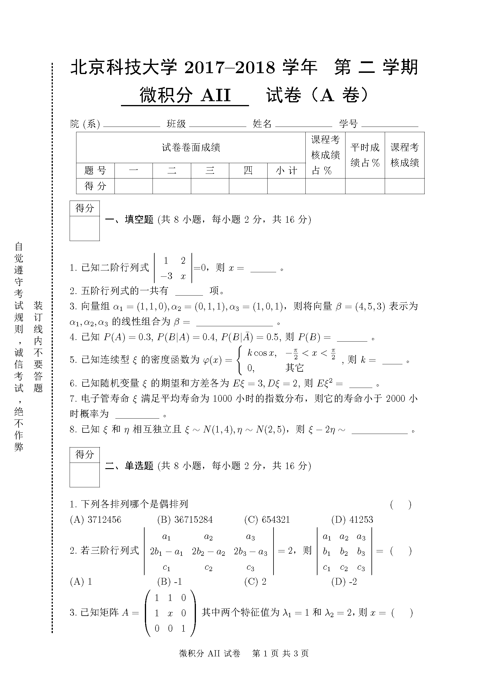
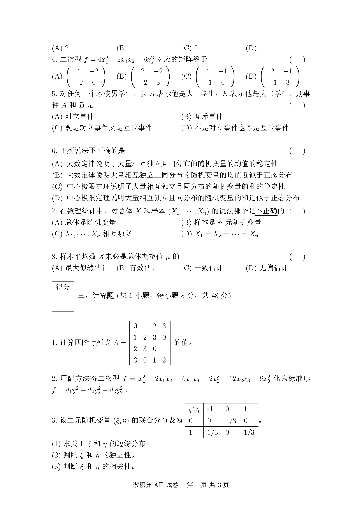
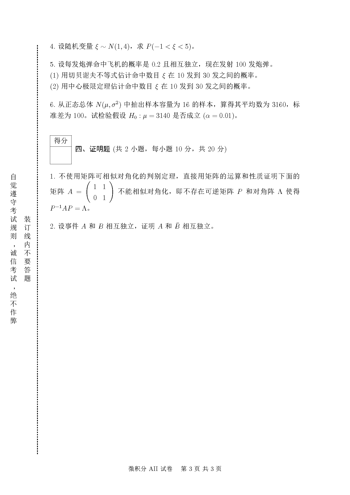

# 北京科技大学试卷 LaTeX 模板

## 试卷效果

### 支持的 feature

- 选择题以 `\options{}{}{}{}` 进行自动排版, 目前只支持四选项
- 试卷表头只需要给出大题数目即可进行自动绘制, 手动实现了一个表格缩放
- 大题前的计分表自动生成, 只需要输入题目描述, 考虑到各科情况不一样 并未对其输入格式进行定制
- 小题的题号自动生成, 无需自行添加
- 支持生成题目答案隐藏, 便于生成带有解析的试卷

### 尚有不足的地方

- 空白试卷分页需要由自己进行控制, 每个题目的留白也需要自己设置
- 对于 LaTeX 层面的命令尚未进行封装, 对于基本没有接触过 LaTeX 格式控制命令的人来说尚不够平易近人

## TODO

- [ ] 使用 zref 宏包, 大题数目由编译自动进行获取
- [ ] 补充一个更加详细的使用说明
- [ ] 将常用的符号进行封装, 如微分算子、散度、旋度、梯度等等
