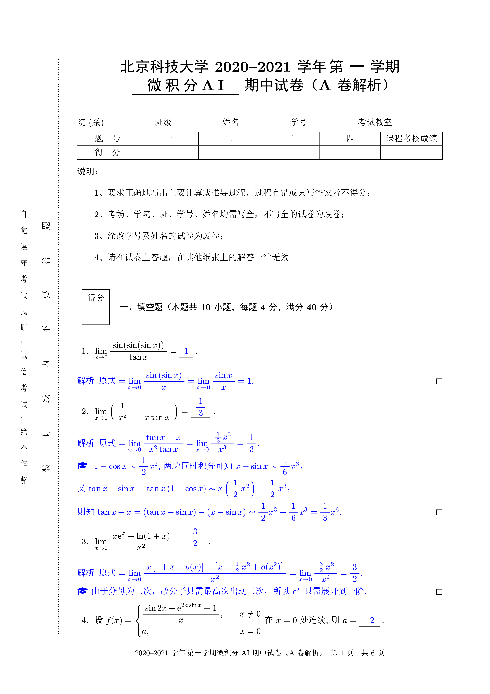
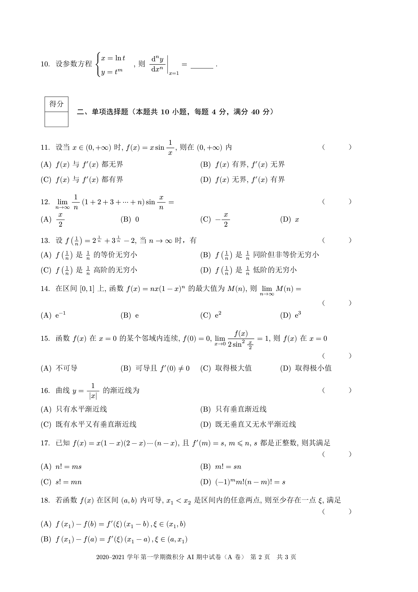
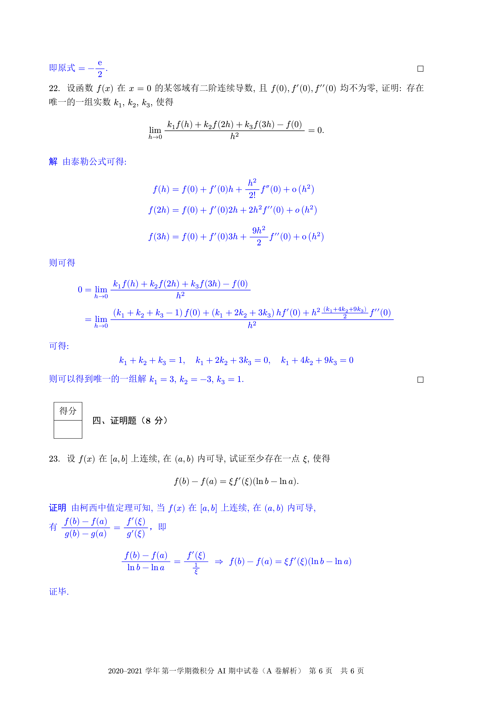

# 北京科技大学试卷 LaTeX 模板

用 [exam-zh](https://gitee.com/xkwxdyy/exam-zh) 进行了重构, 基本没有做破坏性更新

基于 `exam-zh` 的先进性, 你可以在此获得更好的格式与内容分离体验, 基本上只需要进行专注题目解析的录入

此模板基本就只是在 `exam-zh` 的基础上进行了定制, 故更加完善的使用说明应去[上游](https://gitee.com/xkwxdyy/exam-zh)查看.

注:`\mynewpage`、`\vempty`已废弃

## 试卷效果

解析版                       | 学生版
:-------------------------:|:-------------------------:
 | 
 | 
 | 
 | 

### 支持的 feature

- 试卷表头只需要给出大题数目即可进行自动绘制
- 大题前的计分表自动生成, 只需要输入题目描述, 考虑到各科情况不一样, 并未对其输入格式进行定制
- 题号自动生成, 无需自行添加
- 支持生成题目答案隐藏, 便于生成带有解析的试卷
- 增加格式化代码功能

### 尚有不足的地方

- 对于 LaTeX 层面的命令尚未进行封装, 对于基本没有接触过 LaTeX 格式控制命令的人来说尚不够平易近人

## TODO

- [ ] 使用 zref 宏包, 大题数目由编译自动进行获取
- [ ] 补充一个更加详细的使用说明

## 自Mathpix导出的LaTeX代码转换
|                                    查找                                     |                                          替换                                          |           作用           |
| :-------------------------------------------------------------------------: | :------------------------------------------------------------------------------------: | :----------------------: |
|                            `*\([A]+\) *(.+) *\n`                            |                                   `\\options{$1}%\n`                                   |       提取 A 选项        |
|                           `*\([B-D]+\) *(.+) *\n`                           |                                       `{$1}%\n`                                        |      提取 BCD 选项       |
|                          `*\\mathrm\{~?([d])\} *`                           |                                        `\\dif`                                         |          正体 d          |
|                          `*\\mathrm\{~?([e])\} *`                           |                                        `\\upe`                                         |          正体 e          |
|                                   `+d +`                                    |                                        `\\dif`                                         |          正体 d          |
|                            `, ([^\x00-\xff\n]+)`                            |                                        `$1\n$2`                                        | 英文逗号后的中文内容换行 |
|                            `[一二三四五六]、 *`                             |                                      ``|去除题号                                       |
|                            `\\(o?i{2,})nt_(\{?)`                            |                                 `\\$1nt \\limits _$2`                                  |  积分号右下侧改成正下侧  |
|               `\\begin\{CJK\}\{UTF8\}\{mj\}(.+?)\\end\{CJK\}`               |                                          `$1`                                          |       中文内容提取       |
|                           `\\begin\{enumerate\}`                            |                                 ``|去除`enumerate`环境                                 |
|                            `\\end\{enumerate\}`                             |                                 ``|去除`enumerate`环境                                 |
|                       `\\item *([\s\S\n]+?\.?)$\n\n`                        |  `\\begin{question}\n$1\n\\end{question}\n\n\\begin{analysis}\n\n\\end{analysis}\n\n`  |  提取题目，加入解析环境  |
| `\\left\\\{\\begin\{array\}\{[lcr]*\}(.+?\\\\)(.+?)\\end\{array\}\\right\.` |                       `\\begin{cases}\n\t$1\n\t$2\n\\end{cases}`                       | array 环境转 cases 环境  |
|       `\\options\{(.+)\}%?\n *\{(.+)\}%?\n *\{(.+)\}%?\n *\{(.+)\}%?`       | `\\begin{choices}\n\t\\item $1\n\t\\item $2\n\t\\item $3\n\t\\item $4\n\\end{choices}` |      选择题选项处理      |
|                       `\\setcounter\{enumi\}\{\d+\}`                        |                                 ``|去除`enumerate`环境                                 |
|                                    `。`                                     |                                          `.`                                           |    中文句号转英文句号    |
|                                    `，`                                     |                                          `,`                                           |    中文逗号转英文逗号    |

此外，还需要手动处理以下内容：
- 还需要将大题里的`analysis`环境改成`solution`环境或者`proof`环境。
- 选择题需要手动处理 `\paren[]` 命令。
- 填空题需要手动处理 `\fillin[]` 命令。
`cases`环境后的逗号需要自行处理，横向空白需要用`\hspace{-1em}`命令处理。
