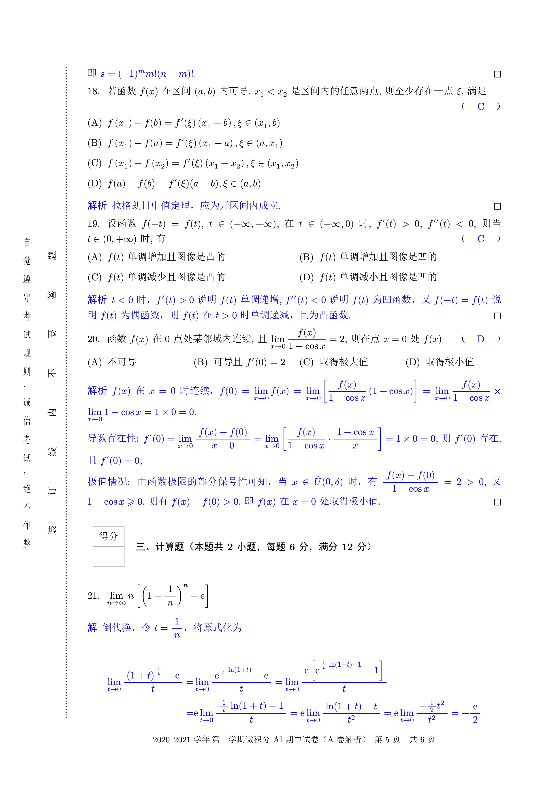
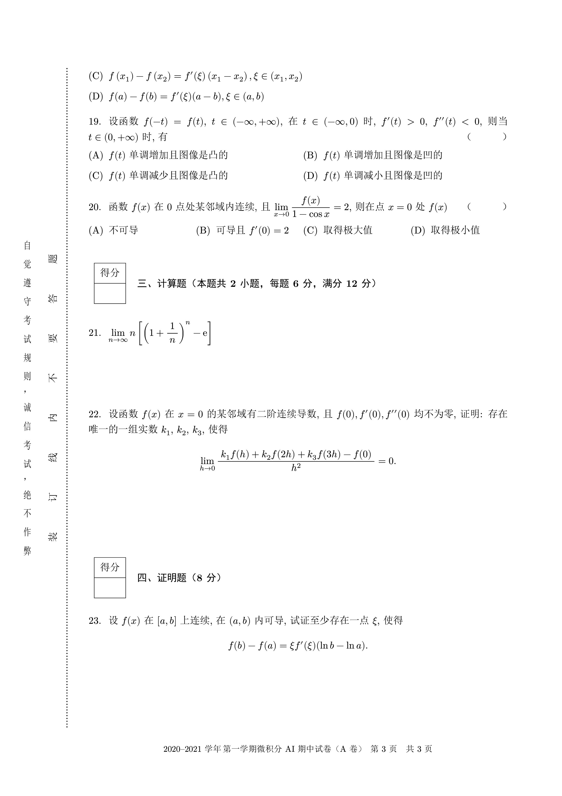

# 北京科技大学试卷 LaTeX 模板

用 `exam-zh` 进行了重构, 基本没有做破坏性更新

`\mynewpage`、`vempty`已废弃

## 试卷效果

解析版                       | 学生版
:-------------------------:|:-------------------------:
 | 
 | 
 | 
 | 

### 支持的 feature

- 试卷表头只需要给出大题数目即可进行自动绘制
- 大题前的计分表自动生成, 只需要输入题目描述, 考虑到各科情况不一样, 并未对其输入格式进行定制
- 题号自动生成, 无需自行添加
- 支持生成题目答案隐藏, 便于生成带有解析的试卷
- 增加格式化代码功能

### 尚有不足的地方

- 对于 LaTeX 层面的命令尚未进行封装, 对于基本没有接触过 LaTeX 格式控制命令的人来说尚不够平易近人

## TODO

- [ ] 使用 zref 宏包, 大题数目由编译自动进行获取
- [ ] 补充一个更加详细的使用说明
